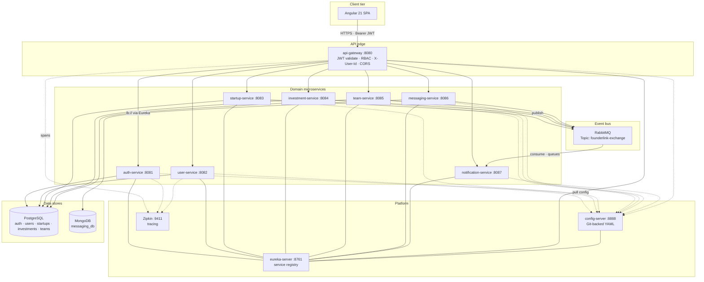
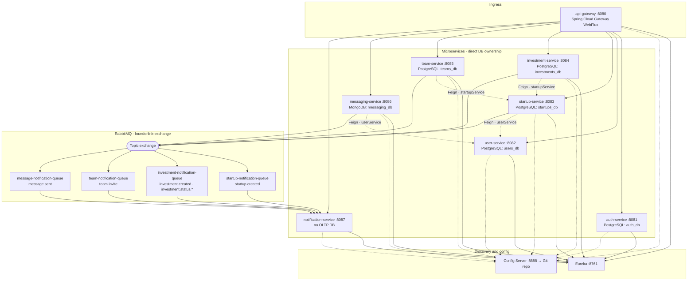

# FounderLink Architecture

## 1) High-Level Design (HLD) and System Overview

### Executive Summary
FounderLink is a **Spring Boot 4.0.4** microservices backend with an **Angular 21** SPA. The platform combines synchronous HTTP APIs with asynchronous domain events:

- **Synchronous path:** Browser (or API client) → **API Gateway** → target microservice(s) over HTTP, with routes resolved via **Eureka** (`lb://…`).
- **Asynchronous path:** Domain services publish events to a **RabbitMQ** topic exchange; **notification-service** binds dedicated queues and consumes events (currently **simulated** logging; mail stack is present for future use).
- **Platform controls:** **Spring Cloud Config** (Git-backed) for shared YAML, **JWT** validation and **RBAC** at the gateway, **Zipkin** for distributed tracing (via `spring-boot-starter-zipkin`).

### HLD diagram

High-level view of the synchronous API path, configuration/discovery, observability, data stores, and the asynchronous event path into notification processing.

### Client application
- **Location:** `frontend/`
- **Stack:** Angular `^21.2.x`, TypeScript `~5.9`, Vitest for unit tests.
- **API usage:** `environment.apiBaseUrl` points at the gateway (default `http://localhost:8080`). An HTTP interceptor attaches the JWT `Authorization: Bearer` header. Route-level **auth** and **role** guards align with backend roles (`ROLE_FOUNDER`, `ROLE_INVESTOR`, `ROLE_COFOUNDER`, `ROLE_ADMIN`).

### Infrastructure stack (from code and config)
- **Language/runtime:** Java `17` (all Maven services).
- **Framework:** Spring Boot `4.0.4`, Spring Cloud BOM `2025.1.1`.
- **Edge:** Spring Cloud Gateway (WebFlux) — `api-gateway` (see `founderlink-config-repo/api-gateway.yml` for routes, timeouts, and Swagger aggregation).
- **Service discovery:** Eureka Server + Eureka clients.
- **Configuration:** Spring Cloud Config Server; Git URI in `config-server` defaults to `https://github.com/ydvdhrj/founderlink-config-repo.git`. A **copy of the same profiles** also lives under `founderlink-config-repo/` in this workspace for reference.
- **Databases**
  - **PostgreSQL** — `auth_db`, `users_db`, `startups_db`, `investments_db`, `teams_db` (per `founderlink-config-repo/*.yml` and `docker-compose.yml` overrides for containers).
  - **MongoDB** — `messaging_db` (messages; URI in `messaging-service` config).
- **Messaging:** RabbitMQ; topic exchange `founderlink-exchange`.
- **Security:** Spring Security + JJWT `0.11.5` (HS256, shared `jwt.secret` between auth and gateway).
- **Observability:** Actuator + Zipkin export (trace IDs in log pattern in shared config).
- **API docs:** Springdoc OpenAPI `3.0.2` per service; gateway **Swagger UI** lists proxied service OpenAPI URLs (`/auth/v3/api-docs`, `/users/v3/api-docs`, etc.).

### Boot sequence and dependencies
Typical order for local or Docker Compose:

1. **Data plane:** PostgreSQL, MongoDB, RabbitMQ, Zipkin (see `docker-compose.yml` — Postgres published on host `5433` → container `5432`).
2. **`eureka-server`** — registry (port `8761`).
3. **`config-server`** — must be up before other services that import config (port `8888`). Compose healthchecks wait for Eureka and Config.
4. **Domain services** — `auth-service`, `user-service`, `startup-service`, `investment-service`, `team-service`, `messaging-service`, `notification-service` (ports `8081`–`8087` per config / Compose).
5. **`api-gateway`** — last; depends on discoverable route targets (port `8080`).

Compose wiring uses `SPRING_CONFIG_IMPORT: optional:configserver:…` for resilience during startup; local `application.yml` files use `configserver:${CONFIG_SERVER_URL:…}` without `optional` — treat Config Server as required for a normal dev run unless you override properties locally.

### Network flow (request lifecycle)
Authenticated calls through the gateway:

1. **Client → Gateway** — Path matches a route in `api-gateway.yml` (`/auth/**`, `/users/**`, `/startups/**`, `/investments/**`, `/teams/**`, `/messages/**`, `/notifications/**`). There is also a route mapping **`/health`** to notification-service for ops checks.
2. **JWT at the edge**
   - **`JwtAuthenticationManager`** validates the Bearer JWT (`type=access`, `userId` claim, `roles` as `SimpleGrantedAuthority`, e.g. `ROLE_FOUNDER`).
   - **`JwtAuthenticationFilter`** (global) runs for non-public paths: after successful authentication, it sets **`X-User-Id`** to the principal user id so downstream services do not re-parse the JWT for identity on mutating operations.
3. **Gateway → service** — `lb://SERVICE-NAME` (Eureka service id, e.g. `lb://USER-SERVICE`).  
4. **Service** — Controllers that need the acting user read **`X-User-Id`** (startup create, investments, team invite/join, messages). **user-service** also resolves the user from the JWT via Spring Security for create/update profile. **Feign** clients in some services forward `X-User-Id` to other services for internal calls.

---

## 2) Low-Level Design (LLD): Service Registry and Components

### LLD diagram

Service ports, data ownership, synchronous **Feign** dependencies between domain services, and **RabbitMQ** bindings consumed by `notification-service` (queues are declared in code; routing keys use the topic exchange `founderlink-exchange`).

### eureka-server
- **Port / DB:** `8761` / none.
- **Role:** Service registry; peers disabled in default config.

### config-server
- **Port / DB:** `8888` / none (Git remote; see `config-server/src/main/resources/application.yml`).
- **Role:** Serves `application.yml` / `{application}.yml` to clients; registers with Eureka.

### api-gateway
- **Port / DB:** `8080` / none.
- **Role:** Single ingress, CORS (allowed origins `*`, methods including `OPTIONS`), JWT + **reactive** `SecurityWebFilterChain` rules, Swagger proxy config.
- **Gateway routes (from `founderlink-config-repo/api-gateway.yml`):** explicit `Path` predicates to `auth-service`, `user-service`, `startup-service`, `investment-service`, `team-service`, `messaging-service`, `notification-service` (notification route uses **`StripPrefix=1`** so `/notifications/...` is forwarded without the first path segment). **Discovery locator is disabled** — only declared routes match.
- **Route-level security (code: `SecurityConfig.java`):** e.g. `/auth/**` and OpenAPI paths public; `POST /startups` requires `FOUNDER`; `POST /investments` requires `INVESTOR`; `PUT /investments/**` requires `FOUNDER`; `GET /investments/**` — `INVESTOR` or `FOUNDER`; team `POST/GET` — `FOUNDER` or `COFOUNDER`; `/messages/**` and `/notifications/**` authenticated.

### auth-service
- **Port / DB:** `8081` / PostgreSQL `auth_db`.
- **Role:** Register, login, refresh, validate, **GET /auth/me**; issues JWTs with `userId` and `roles` (`RoleName`: `ROLE_FOUNDER`, `ROLE_INVESTOR`, `ROLE_COFOUNDER`, `ROLE_ADMIN`).
- **Key API (see `AuthController`):** `POST /auth/register`, `POST /auth/login`, `POST /auth/refresh`, `POST /auth/validate`, `GET /auth/me`.

### user-service
- **Port / DB:** `8082` / PostgreSQL `users_db`.
- **Role:** Profile directory, CRUD, JWT-backed authorization for create/update.
- **Key API (see `UserController`):** `GET /users` (paginated directory), `GET /users/{userId}`, `GET /users/lookup?email=…`, `GET /users/ids?limit=…`, `POST /users`, `PUT /users/{userId}`.

### startup-service
- **Port / DB:** `8083` / PostgreSQL `startups_db` (port overridable via `SERVER_PORT`).
- **Role:** Create/list/get startups; **Feign** to `user-service` with Resilience4j **`userService`** circuit breaker; publishes **`startup.created`** to RabbitMQ.

### investment-service
- **Port / DB:** `8084` / PostgreSQL `investments_db`.
- **Role:** Create investments (validates startup via **Feign** + **`startupService`** circuit breaker), list by startup/investor, founder updates status; publishes **`investment.created`** and, on approve/reject, **`investment.status.approved`** / **`investment.status.rejected`** (map payload with `eventType=INVESTMENT_STATUS_CHANGED`).

### team-service
- **Port / DB:** `8085` / PostgreSQL `teams_db`.
- **Role:** Invite and join flows, list by startup; **Feign** to `startup-service` + **`startupService`** breaker; publishes **`team.invite`**.

### messaging-service
- **Port / DB:** `8086` / MongoDB `messaging_db`.
- **Role:** Send message, conversation history; **Feign** to `user-service` + **`userService`** breaker; publishes **`message.sent`**.

### notification-service
- **Port / DB:** `8087` / no primary transactional DB; **RabbitMQ** required.
- **Role:** Declares **queues** and **topic bindings** to `founderlink-exchange`; **`@RabbitListener`** handlers consume:
  - `startup.created` → `startup-notification-queue`
  - `investment.created`, `investment.status.*` → `investment-notification-queue`
  - `team.invite` → `team-notification-queue`
  - `message.sent` → `message-notification-queue`  
  Processing is **simulated email logging** (`NotificationListener`). **`spring-boot-starter-mail`** is on the classpath with defaults pointing at local SMTP (e.g. port `1025` in config — suitable for MailHog/Mailpit in dev).
- **HTTP:** `GET /health` (also exposed via gateway as **`/health`** through the dedicated route). OpenAPI is wired for gateway aggregation under `/notifications/**`.

---

## 3) Frontend (Angular) map

Feature areas under `frontend/src/app/features/` (routes in `app.routes.ts`):

- **Auth:** login, signup (guest-only routes).
- **Shell layout:** dashboard, profile (view/create/edit), user directory and profile detail.
- **Startups:** list, detail, create (guarded: `ROLE_FOUNDER` / `ROLE_ADMIN`).
- **Investments:** list for the signed-in user.
- **Teams:** invite flow (guarded founder/admin).
- **Messages:** conversation UI with optional `otherUserId` route param.

Core **`apiBaseUrl`** is the gateway; **`auth.interceptor`** attaches tokens; **`error.interceptor`** handles API errors.

---

## 4) Data Architecture and Event-Driven Flow

### PostgreSQL
Relational stores for auth, user profiles, startups, investments, teams — **DDL** typically `update` in dev (`spring.jpa.hibernate.ddl-auto` in config).

### MongoDB
Document store for chat messages and conversation queries.

### RabbitMQ topology (implemented)
- **Exchange:** `founderlink-exchange` (topic, durable).
- **Publishers:** `startup-service`, `investment-service`, `team-service`, `messaging-service` (each declares the exchange; JSON via `Jackson2JsonMessageConverter` where configured).
- **Consumer:** `notification-service` declares queues, bindings, and listeners (see `RabbitMQConfig` + `NotificationListener`).

**Routing keys in use**

| Domain      | Routing key(s) |
|------------|----------------|
| Startup    | `startup.created` |
| Investment | `investment.created`, `investment.status.approved`, `investment.status.rejected` |
| Team       | `team.invite` |
| Messaging  | `message.sent` |

---

## 5) Security and Observability

### JWT and RBAC
- **Issuance (`auth-service`):** Access tokens include `type=access`, `userId`, `roles` as strings such as `ROLE_FOUNDER`.
- **Gateway:** HS256 with shared secret; `hasRole('FOUNDER')` expects **`ROLE_FOUNDER`** in the token (standard Spring Security semantics).
- **Identity propagation:** **`JwtAuthenticationFilter`** sets **`X-User-Id`** for downstream services on protected routes.

### Tracing and logging
- Services depend on **`spring-boot-starter-zipkin`** and enable tracing toward Zipkin in shared config (`management.tracing.export.zipkin.endpoint`).
- Log pattern in config includes trace/span placeholders for correlation across services.

---

## 6) Docker Compose (reference)

`docker-compose.yml` builds and runs the full stack: infra, Eureka, Config, all seven domain services, and the gateway, with environment overrides for JDBC/Mongo/Rabbit/Zipkin URLs inside the Docker network. Postgres host port **`5433`** maps to `5432` in the container — align JDBC URLs when running services on the host vs in Compose.

---

## 7) Known gaps / caveats (current codebase)

- **Notifications:** Event consumption is implemented; delivery is **log-based simulation**, not production email sending wired end-to-end.
- **Config source of truth:** Runtime routing and datasource URLs for non-default profiles come from the **Config Server Git repo**; the workspace copy under `founderlink-config-repo/` should stay in sync when documenting routes or ports.
