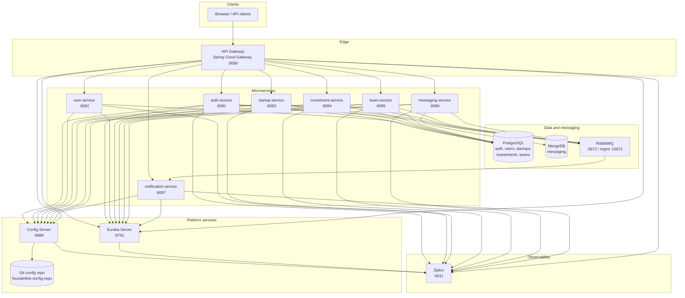
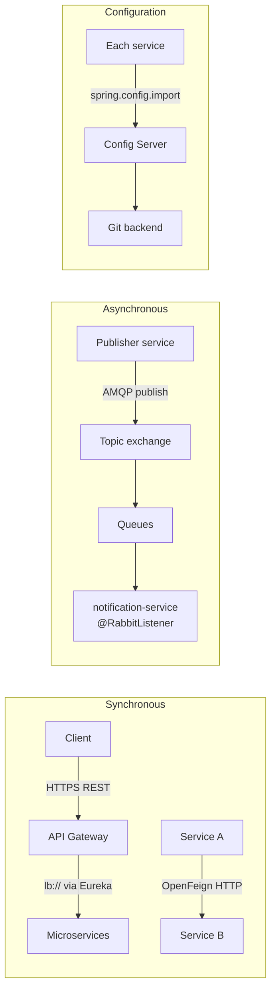

# FounderLink — High-Level Design (HLD)

FounderLink is a Spring Boot microservices platform. Clients call the **API Gateway** (`8080`); the gateway discovers routes via **Eureka** and proxies to domain services. **Spring Cloud Config Server** (`8888`) serves centralized YAML from **Git**. Services use **PostgreSQL** (per-domain databases), **MongoDB** for messaging, **RabbitMQ** for events (consumed notably by **notification-service**), and **Zipkin** for distributed tracing.

---

## System context

Paste the block below into [Excalidraw](https://excalidraw.com) via **More tools → Mermaid to Excalidraw** (or your editor’s Mermaid import).

---

## Communication styles

---

## Local URLs (Docker Compose defaults)

| Component        | URL |
|-----------------|-----|
| API Gateway     | http://localhost:8080 |
| Eureka          | http://localhost:8761 |
| Config Server   | http://localhost:8888 |
| Swagger (GW)    | http://localhost:8080/swagger-ui.html |
| Zipkin          | http://localhost:9411 |
| RabbitMQ UI     | http://localhost:15672 |
